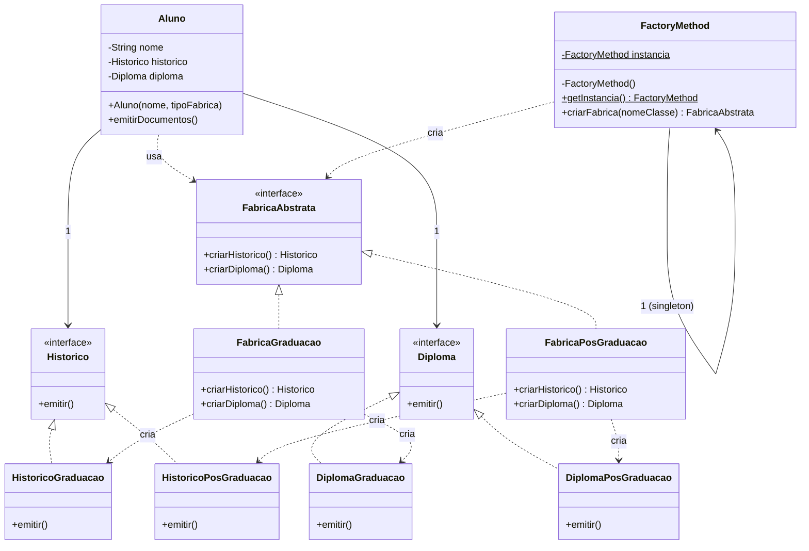

# Atividade — Unificando Abstract Factory, Factory Method e Singleton

Projetinho em Java que mostra os três padrões de criação trabalhando juntos
num único cenário: emissão de documentos (`Historico` e `Diploma`) para
alunos de Graduação e Pós-Graduação.

## Ideia geral

- **Abstract Factory** — `FabricaAbstrata` garante que `Historico` e
  `Diploma` sempre saiam "casados" (os dois de Graduação ou os dois de
  Pós-Graduação, nunca misturados).
- **Factory Method** — `FactoryMethod.criarFabrica(nomeClasse)` decide, em
  tempo de execução, qual `FabricaAbstrata` concreta instanciar (usa
  `Class.forName` + `newInstance`, por isso a dependência de `Class` e
  `Object`).
- **Singleton** — `FactoryMethod` só existe em uma instância
  (`getInstancia()`), então todo mundo no sistema pede fábricas pelo mesmo
  ponto de acesso.

`Aluno` é quem consome tudo isso: recebe o tipo de fábrica desejado, pede
a fábrica pro `FactoryMethod` (singleton) e usa a fábrica pra montar seu
`Historico` e `Diploma`, sem conhecer nenhuma classe concreta.

## Estrutura de arquivos

```
Historico.java              (interface — produto)
Diploma.java                (interface — produto)
HistoricoGraduacao.java     (produto concreto)
HistoricoPosGraduacao.java  (produto concreto)
DiplomaGraduacao.java       (produto concreto)
DiplomaPosGraduacao.java    (produto concreto)

FabricaAbstrata.java        (interface — Abstract Factory)
FabricaGraduacao.java       (fábrica concreta)
FabricaPosGraduacao.java    (fábrica concreta)

FactoryMethod.java          (Singleton + Factory Method)
Aluno.java                  (cliente dos padrões)
Main.java                   (demo)

*Test.java                  (testes JUnit 4, um por classe)
```

## Como compilar e rodar

```bash
javac -encoding UTF-8 *.java
java Main
```

## Como rodar os testes

Precisa do `junit-4.13.2.jar` e `hamcrest-core` no classpath (ou a
dependência `junit:junit:4.13.2` se estiver usando Maven/Gradle).

```bash
javac -encoding UTF-8 -cp .:junit-4.13.2.jar:hamcrest-core.jar *.java
java -cp .:junit-4.13.2.jar:hamcrest-core.jar org.junit.runner.JUnitCore \
  HistoricoGraduacaoTest HistoricoPosGraduacaoTest \
  DiplomaGraduacaoTest DiplomaPosGraduacaoTest \
  FabricaGraduacaoTest FabricaPosGraduacaoTest \
  FactoryMethodTest AlunoTest
```

## Esboço do diagrama de classes



**Como ler:** setas tracejadas com ponta aberta (`..|>`) são
"implementa/realiza uma interface"; setas tracejadas com ponta fina
(`..>`) são "depende de / cria"; a seta cheia (`-->`) é associação normal.
O auto-loop em `FactoryMethod` com multiplicidade `1` representa o
Singleton — só existe uma instância dele no sistema inteiro.
